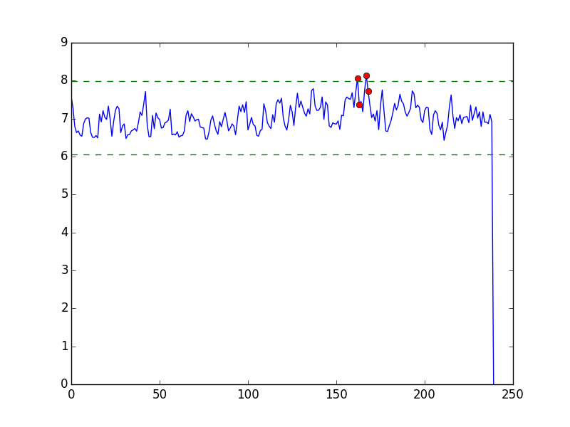
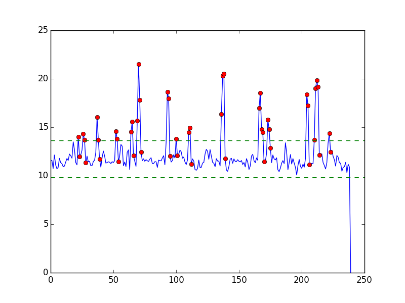

% Analysis Report
% Jon Miguel Jara, Juan Shishido, Paul Wu, Wendy Xu
% November 12, 2015

# Introduction

## The Paper

The Neural Basis of Loss Aversion in Decision-Making Under Risk

Authors: Tom, Fox, Trepel, and Poldrak (2007)

Idea:

> We investigated neural correlates of loss aversion while individuals decided
whether to accept or reject gambles that offered a 50/50 change of gaining or
losing money.

## The Data

- 16 subjects are presented with a gamble with gain and loss values and asked whether they will take the gamble or not. 
- Subject has behavorial data that corresponds with each gamble + a binary varaible indicating whether the took the gamble or not. 
- Each subject also has a bold.nii with an fMRI image along time courses while the experiment was being conducted 
	- Challenge: combine the behvaorial data (with gain and loss values) and the fMRI image data for modeling purposes. 

## methods of Analysis

- Linear Regression
	
- MVPA (Multi-voxel pattern analysis)

## Linear Regression Description 
- Writing pre-proccessing functions 
	- Outliers 
	- Smoothing
- Creating a meaningful design matrix for linear regression 
   	- including size of gain,loss, and a convolved regressor
- Applying a linear model on each voxel
- incorporating *every* subject and *every* run (by averaging)
- Plotting 
- Final Goal: Use plots of beta coefficients to find areas of the brain sensitive to loss and gains
	- Are they the same? Are they oppisites?

## Pre-Proccessing  
- Used RMS vector method for removing outlying volumes before analysis 
	- some subjects/runs had 0 outlying volumes while some had as much as 40+
- Used Gaussian Filter by 2 SD's in all 3 spatial dimensions 

## sub001/run001	

## sub009/run003

## Created a design matrix for regression
- Created 4 by 240 (number of volumes) design matrix for each subject that had columns for loss, gain, and a convolved regressor 

> Regressors of interest were created by convolving a delta function representing trial onset times with a
canonical (double-gamma) hemodynamic response function.

## Applying the model and aggregating data 

- Aggregation 
	- Instead of observing only 1 subject, we applied our linear model to every:
		- Run (averaged betas for every run for each subject)
		- Subject (averaged betas for every subject in the study)
	- Result: "average" volumes for gain and loss coefficients for analysis 
- Back to our question: Which parts of the brain are most sensitive to gains and losses? Are they the same 

	

# Plan

## Statistical Analyses

\includegraphics[width=<X>\textwidth]{<SD_2_Gain.ong>}%
\includegraphics[width=<1-X>\textwidth]{<SD_2_loss.png>}

## Regression

## Multi-Pattern Voxel Analysis

Used for estimating the whole brain.

Norman, Polyn, Detre, and Haxby (2006)

## Tools

- NumPy
- Nibabel
- Statsmodels
- Scikit-Learn
- Nilearn
- PyMVPA
- Matplotlib
- Seaborn

# Process

## Most Difficult Part

- defining and scoping an analysis plan
    - data approaches
    - analyses methods
- Git workflow
    - coordination
